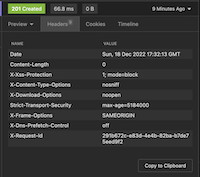
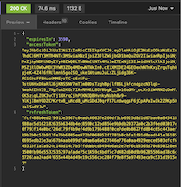

# Authentication

Green Cloud has built in Authentication from the ground up. From the early days we realised that security is a big part of a cloud system. As such we use industry strength encryption and STRONGLY encourage our users to use 2FA which dramatically reduces the chances of an attack on an account.

The firsrt thing you will need to do is to Register an account.

## Register

Use this end point to register an account with Green Cloud. The succesful response is a HTTP 201 response. An email will be sent to the person enabling them to complete the registration of their account.

#### End Point: [http://localhost:3000/api/auth/register](http://localhost:3000/api/auth/register)

```js title="HTTP VERB"
POST
```

```js title="Content Header"
application/json
```

```js title="Body"
{
	"name": "Boris",
	"surname": "Johnson",
	"email": "your.email@here.com",
	"password":"password-here",
	"nationality": "Great Britain"
}
```

#### Response: 

HTTP 201 



## Login

Once a user has finished the Registration of their account. Then can then Login and get an access and refresh token.

End Point: [http://localhost:3000/api/auth/login](http://localhost:3000/api/auth/login)

```js title="HTTP VERB"
POST
```

```js title="Content Header"
application/json
```

```js title="Body"
{
	"email": "boris.johnson@parliament.co.uk",
	"password": "brexitisntdone"
}
```

#### Response

HTTP 200 



## Refresh Token

Once a user has been given an Access Token and a Refresh Token from the Login end point, you can use the Refresh Token to gain a new Access Token. Access Tokens are valid for 90 days.

End Point: [http://localhost:3000/api/auth/refresh](http://localhost:3000/api/auth/refresh)

```js title="HTTP VERB"
POST
```

```js title="Content Header"
application/json
```

```js title="Body"
{
	"refreshToken": "PUT YOUR REFRESH TOKEN HERE"
}
```

#### Response

HTTP 200 


## API KEY

## 2FA - ( Two Factor Authentication )

## Active 2FA

## Disable 2FA