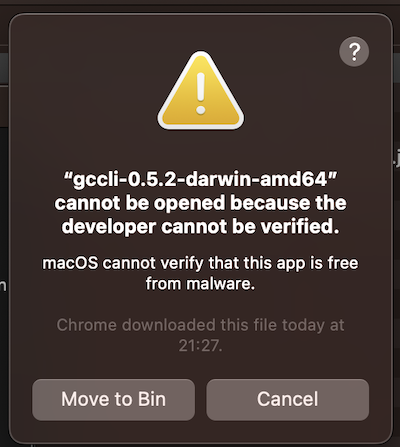
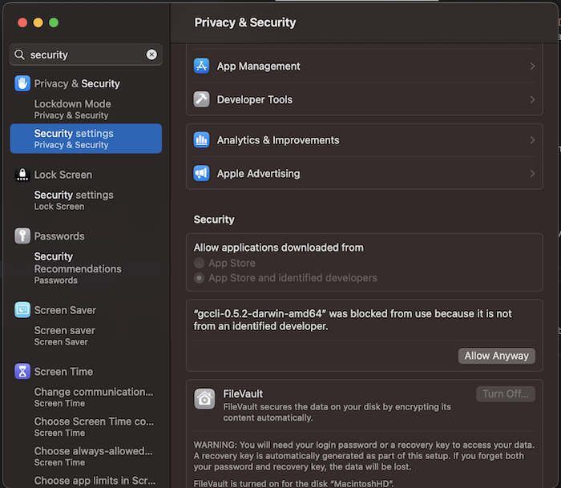

# 🧑‍💻 Installing the CLI !

You can download the CLI from this link -:

[Green Cloud CLI Tool](https://dl.greencloudcomputing.io/gccli)

On Linux and OSX machines you will need to convert the file into a executable. Use the CHMOD command to achieve this -:

```console
    chmod +x gccli-0.5.2-darwin-amd64
```

This tells the operation system that the file is an executable. On a MAC machines, if you get a message like this,



then open the System Settings window (top left Apple icon) and select Security Settings. ( Specific namings may vary due to OS updates / versions ). You should see a screen that is similar to this -:



Click the button "Allow Anyway". The computer will ask you to authenticate with your user name or password.You should then be able to allow the CLI tool to be enabled on your machine!


The rest of the pages in this section will be spent detailing the various niche calls in the CLI and how they work and inter-operate.
