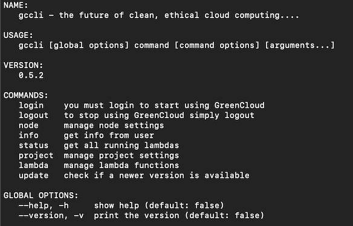

# Introduction

Where to start! The CLI is one of the earliest tools that we created with Green Cloud and it really is where a lot of the 'power' lies with Green Cloud and a software developer.

- You will need to install [Docker](https://www.docker.com/) for your device as we use it extensively.

- You will also need a valid Green Cloud account (create one here) [Green Cloud - Sign Up](https://app.greencloudcomputing.io/signup)

- You can download the CLI from -: [Green Cloud CLI Tool](https://dl.greencloudcomputing.io/gccli) -  Make sure you select the correct version to download for your computer

Once you have correctly installed the CLI - you can run it and see the following output -:

The rest of the pages in this section will be spent detailing the various niche calls in the CLI and how they work and inter-operate.