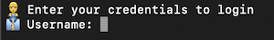
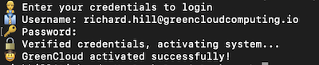
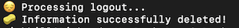

# Logging In And Out!

### Logging In

You've downloaded the CLI tool and are ready to start. Before you can get going you need to sign into the account. 

If you have not created a Green Cloud account yet then you can do so [here](https://app.greencloudcomputing.io/signup)

If all is in place simply type -:

```console
    ./gccli login
```

You will be prompted as follows -:



Enter the email that you used when you created your account! Next enter your password -:



You are now good to go and can start to create projects and Green Cloud functions! 

### Logout

To logout simply type -:

```console
    ./gccli logout
```


