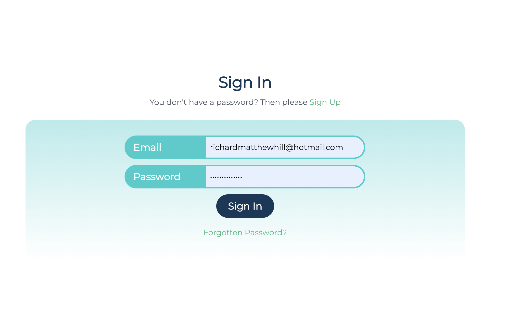

# Account

To use GreenCloud you must have successfully registered for an account. Upon activation, you will be given a free quota to get you started and may upgrade when you are ready.

## Sign Up

To sign up for a GreenCloud account please visit - [GreenCloud - Sign Up](https://app.greencloudcomputing.io/signup)

You will need to enter your

-   First Name
-   Last Name
-   Email
-   Password

## Sign In

To sign in, to your GreenCloud account please visit [GreenCloud - Sign In](https://www.app.greencloudcomputing.io/signin) :

You will need to enter the following information

-   GreenCloud account name ( email address )
-   GreenCloud account password

Upon the correct entry of credentials you will be re-directed to the GreenCloud App dashboard to curate your account.

## Reset Password

If you have forgotten your password, don't worry! See the steps below to reset your GreenCloud account password!

-   Navigate to the reset password link [GreenCloud - Password Reset](https://app.greencloudcomputing.io/forgotten)
-   Enter your email address associated with your GreenCloud account
-   If the email address matches a know GreenCloud account you will receive an email with a password reset link in it.

