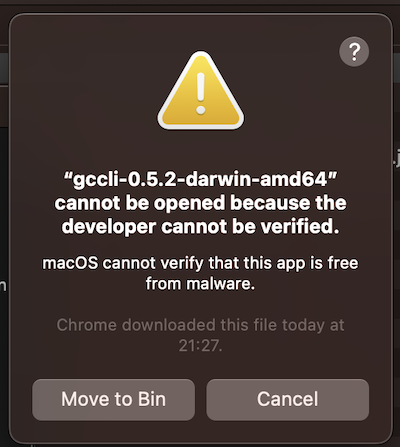

# 🧑‍💻 Installing the CLI !

You can download the CLI from this link → [GreenCloud CLI Tool](https://app.greencloudcomputing.io/downloads)

### Linux and OSX

On Linux and OSX machines you will need to convert the file into a executable. Use the CHMOD command to achieve this :-

```
chmod +x gccli-0.5.2-darwin-amd64
```

This tells the operation system that the file is an executable. On MAC machines, if you get a message like this,



then open the System Settings window (top left Apple icon) and select Security Settings. (Specific namings may vary due to OS updates / versions). You should see a screen that is similar to this :-


Click the button "Allow Anyway". The computer will ask you to authenticate with your user name or password. You should then be able to access the CLI tool on your machine!

### Windows

On Windows machines you will need to place the gccli.exe file in the windows/system32 folder.

### Running the CLI tool

Running the CLI tool will look as below:-

<cliWindow>

```text {1}
$ gccli
NAME:
  gccli - the future of clean, ethical cloud computing....

USAGE:
  gccli [global options] command [command options] [arguments...]

VERSION:
  23.04.08

COMMANDS:
  login         you must login to start using GreenCloud
  logout        logout to stop using GreenCloud CLI
  node          manages node settings
  info          gets info from user
  status        gets all running function
  function, fx  manages functions
  update        checks if a newer version is available

GLOBAL OPTIONS:
  --help, -h     show help
  --version, -v  print the version
```

</cliWindow>

The rest of the pages in this section will be spent detailing the various niche calls in the CLI and how they work and inter-operate.
