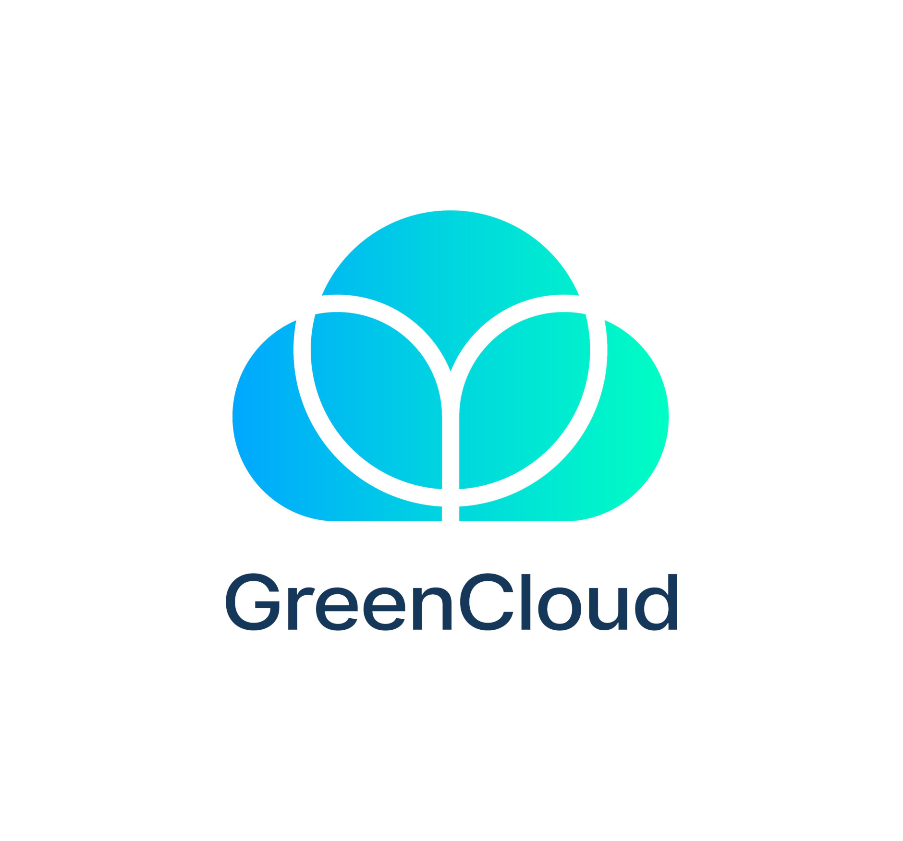

import Tabs from '@theme/Tabs';
import TabItem from '@theme/TabItem';
import BrowserWindow from '@site/src/components/BrowserWindow';

# 💾 Storing files in GreenCloud

## How does it work?

GreenCloud allows you to create a storage function where you can store files up to 1mb in size.  

GreenCloud ensures your files are private by masking important information. Files are broken down across multiple server nodes to ensure security.  

## Creating a storage function

#### 1. Use the gccli command

```
gccli fx init
```

#### Example

<cliWindow>

```text {1}
$ gccli fx init  
🔑 Obtaining accessToken...
👷 Validating inputs...
🥼 Name → storageTests
🔖 Language → go
👔 Description → Creating test storage
⌚ Timeout → 10
📡 Sharing information...
📄 Copying template...
📝 Saving configuration...
🌱 Function created successfully!
```

</cliWindow>

#### 2. Open your created function.

#### Example

```go

package function

import (
	"net/http"

	handler "github.com/openfaas/templates-sdk/go-http"
)

// Handle a function invocation
func Handle(req handler.Request) (handler.Response, error) {
	var err error

	body := req.Body
	headers := http.Header{
		"Content-Type": []string{req.Header.Get("Content-Type")},
	}

	if len(body) == 0 {
		body = []byte("Hello from GO by GreenCloud!")
		headers.Set("Content-Type", "text/plain; charset=utf-8")
	}

	return handler.Response{
		Body:       body,
		StatusCode: http.StatusOK,
		Header:     headers,
	}, err
}

```


#### 3. Write your code to create storage and then store your information within.

#### Example

<Tabs groupId="Storage Example">
<TabItem value="Text">

```go

package function

import (
	"encoding/base64"
	"net/http"

	handler "github.com/openfaas/templates-sdk/go-http"
)

func Handle(req handler.Request) (handler.Response, error) {
	// set headers
	headers := http.Header{}
	headers.Set("Content-Type", "text/plain")

	// get storage
	storage := req.Header.Get("GC-Storage")
	body, err := base64.StdEncoding.DecodeString(storage)
	if err != nil || len(body) == 0 {
		// set storage
		newStorage := base64.StdEncoding.EncodeToString([]byte("I am a storage Test!"))
		headers.Set("GC-Storage", newStorage)

		// if no storage is found, return default text
		return handler.Response{
			Body:       []byte("No storage found"),
			StatusCode: http.StatusNotFound,
			Header:     headers,
		}, nil
	}

	return handler.Response{
		Body:       body,
		StatusCode: http.StatusOK,
		Header:     headers,
	}, nil
}
```

</TabItem>

<TabItem value="JSON">

```go

package function

import (
	"encoding/base64"
	"encoding/json"
	"net/http"

	handler "github.com/openfaas/templates-sdk/go-http"
)

func Handle(req handler.Request) (handler.Response, error) {
	var body []byte

	// set headers
	headers := http.Header{}

	// get storage
	storage := req.Header.Get("GC-Storage")
	text, err := base64.StdEncoding.DecodeString(storage)
	if err != nil || len(text) == 0 {
		// set storage
		jsonStorage, _ := json.Marshal(map[string]interface{}{"user": "root", "password": "root"})
		newStorage := base64.StdEncoding.EncodeToString(jsonStorage)
		headers.Set("GC-Storage", newStorage)

		// if no storage is found, return default text
		headers.Set("Content-Type", "text/plain")
		return handler.Response{
			Body:       []byte("No storage found"),
			StatusCode: http.StatusNotFound,
			Header:     headers,
		}, nil
	} else {
		var jsonObject map[string]interface{}
		if err := json.Unmarshal(text, &jsonObject); err == nil {
			jsonObject, err := json.Marshal(jsonObject)
			if err == nil {
				body = jsonObject
				headers.Set("Content-Type", "application/json")
			}
		}
	}

	return handler.Response{
		Body:       body,
		StatusCode: http.StatusOK,
		Header:     headers,
	}, nil
}
```


</TabItem>

<TabItem value="image/png">

```go

package function

import (
	"embed"
	"encoding/base64"
	"net/http"

	handler "github.com/openfaas/templates-sdk/go-http"
)

//go:embed img
var images embed.FS

func Handle(req handler.Request) (handler.Response, error) {
	var body []byte

	// set headers
	headers := http.Header{}
	headers.Set("Content-Type", "text/plain")

	// Get Storage
	storage := req.Header.Get("GC-Storage")
	imgInStorage, err := base64.StdEncoding.DecodeString(storage)
	if err != nil || len(imgInStorage) == 0 {
		// read image file from disk
		imgToStore, err := images.ReadFile("img/gc-centered.png")
		if err != nil {
			return handler.Response{
				Body:       []byte(err.Error()),
				StatusCode: http.StatusInternalServerError,
				Header:     headers,
			}, nil
		}

		// set Storage
		newStorage := base64.StdEncoding.EncodeToString(imgToStore)
		headers.Set("GC-Storage", newStorage)

		// if no storage is found, return default text
		return handler.Response{
			Body:       []byte("No storage found"),
			StatusCode: http.StatusNotFound,
			Header:     headers,
		}, nil
	} else {
		// if storage is found, return the image
		body = imgInStorage
		headers.Set("Content-Type", "image/png")
	}

	return handler.Response{
		Body:       body,
		StatusCode: http.StatusOK,
		Header:     headers,
	}, nil
}

```

</TabItem>

</Tabs>

#### 4. Deploy your code to GreenCloud

<cliWindow>

```text {1}
 $ gccli fx deploy
👷 Verifying configuration...
📦️ Archs: AMD64
⏳️ Process may take a while, please wait...
🧩 Compiling multi-arch image [OK]                              
🚚 Pushing image to registry...
🔥 Function successfully uploaded!
```

</cliWindow>

#### 5. Create a public endpoint URL.

<cliWindow>

```text {1}
 $ gccli fx public
👷 Validating inputs...
🚨 You must keep the public endpoint safe!
✋ Do you wish to continue? (y/n) → y
🤖 Public endpoint created successfully!
🔗 https://api.greencloud.dev/gc/6655ff265b7bb1846afb0f6a
```

</cliWindow>

#### 6. Access your public endpoint using the link provided.

#### Example

<BrowserWindow url="https://api.greencloud.dev/gc/6655ff265b7bb1846afb0f6a">

⏳ Your function is queued up and will be executed in due time.

The result will be available for the next 5 minutes at the link below.

https://api.greencloud.dev/gc/6656ef17f9440e67ae781692/result

</BrowserWindow>

#### 7. Follow the result link to retrieve your result.

#### Example

<Tabs groupId="Storage Example">
<TabItem value="Text">

<BrowserWindow url="https://api.greencloud.dev/gc/6656ef17f9440e67ae781692/result">

I am a storage Test!

</BrowserWindow>

</TabItem>

<TabItem value="JSON">

<BrowserWindow url="https://api.greencloud.dev/gc/6656ef17f9440e67ae781692/result">

```JSON
{
    "password": "root",
    "user": "root"
}

```

</BrowserWindow>

</TabItem>

<TabItem value="image/png">

<BrowserWindow url="https://api.greencloud.dev/gc/6656ef17f9440e67ae781692/result">



</BrowserWindow>

</TabItem>

</Tabs>


#### 8. Make sure to delete the endpoint when it is no longer needed.

#### Example

<cliWindow>

```text {1}
 $ gccli function public --id 6655ff265b7bb1846afb0f6a --delete
🔑 Obtaining accessToken...
👷 Validating inputs...
🔖 ID → 6655ff265b7bb1846afb0f6a
🔥 Public endpoint deleted successfully!
```

</cliWindow>