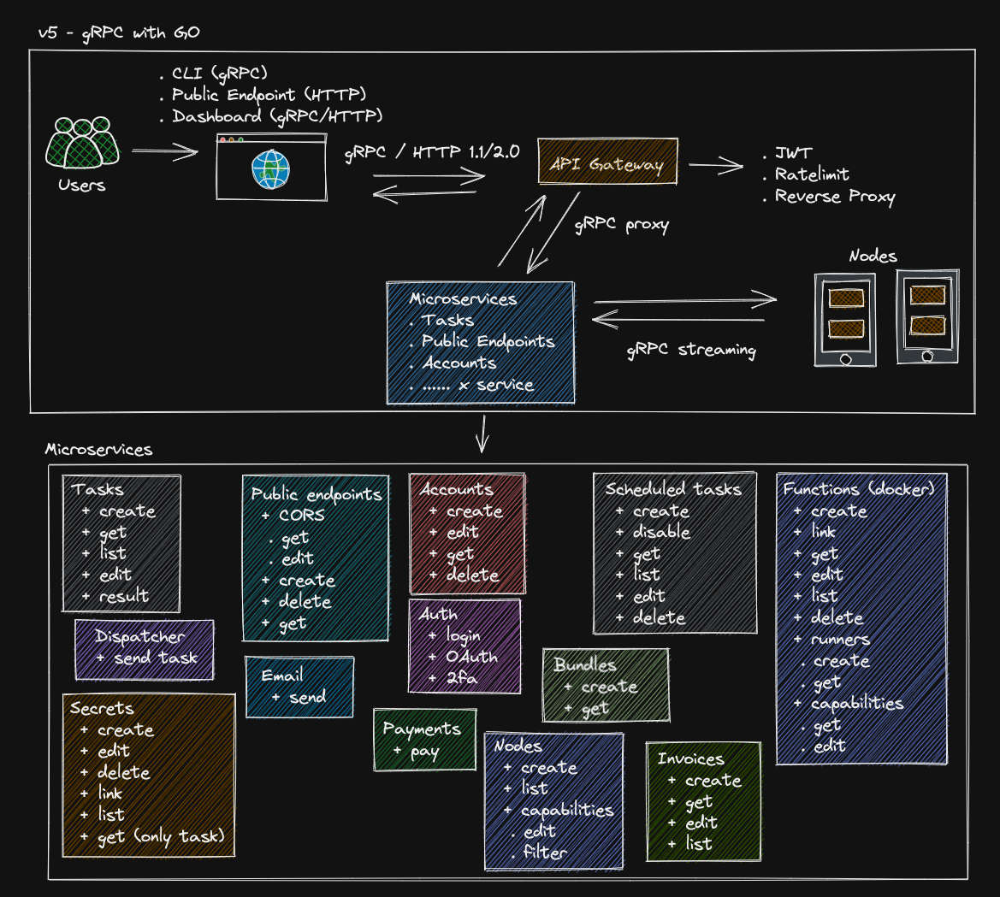

# Green Cloud - Welcome - !

Its great to have you with us and we welcome you to the documentation pages for Green Cloud. Here you will be able to find detailed information about Green Cloud software tools we are creating. Please use this web site as a reference source of all things Green Cloud!

If something doesn't quite look right - OR - its missing - please email us here -: hello@greencloudcomputing.io

Below is an overview of the main constituent parts to the Green Cloud eco system.

What we have created with Green Cloud has not been attempted before. As such we have been refining our approach with regards to how we will handle the workload that we will be presented with. 

The above diagram represents the fifth iteration of Green Cloud! 

What started out as simply getting one computer talking to another across the internet has grown in to a fully fledged scalable system that is capable of performing code tasks on almost any platform! 

We have split the documentation in to the main sections of the Green Cloud software suite.

#### API
 
 - This section documents all of the microservices that we use in Green Cloud and how to call them.

#### CLI

 - Possibly the most powerful tool in Green Cloud - this section documents its functionality and the best steps in how to use it.

#### Guide

 - In this section we go over some common issues and also techniques we have created when working with Green Cloud.